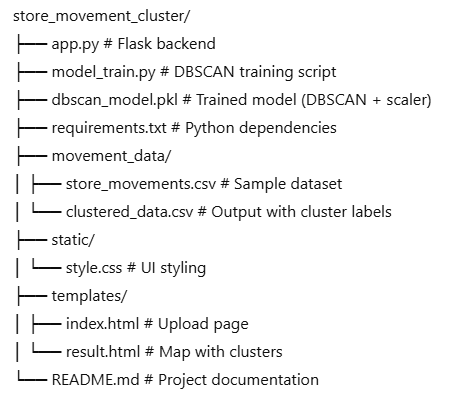
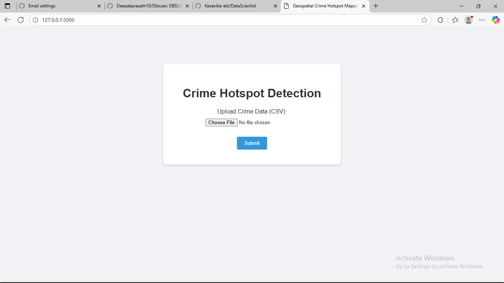
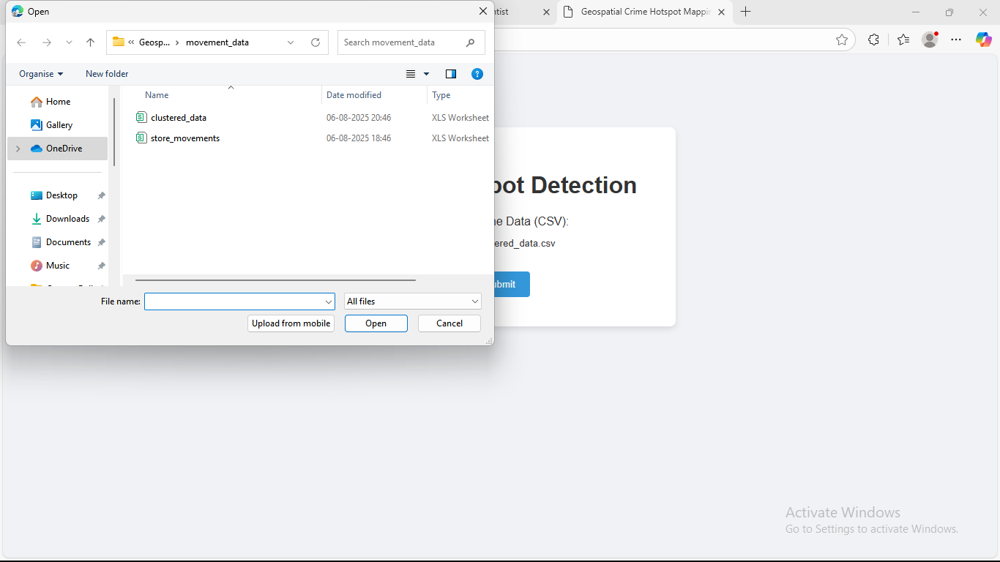
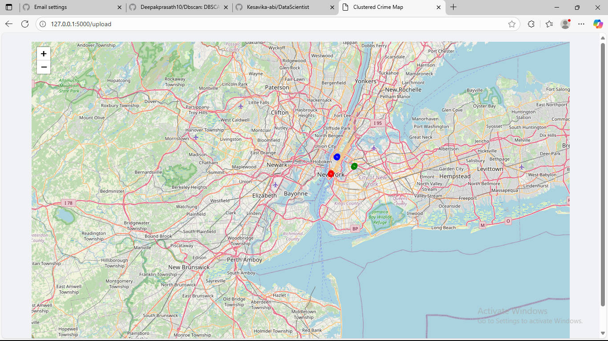

# Geospatial Crime Hotspot Mapping using DBSCAN

This project demonstrates how to use **DBSCAN clustering** to identify **crime hotspots** based on latitude and longitude data. It is built using Python, Scikit-learn, Folium, and Flask, and visualizes dense crime areas on an interactive map.

---

## Objective

To assist law enforcement by clustering crime incidents based on their geolocation and visually identifying hotspots where crimes occur more frequently.

---

## Algorithm Used

- **DBSCAN** (Density-Based Spatial Clustering of Applications with Noise)
  - Handles arbitrary-shaped clusters
  - Detects outliers (noise)
  - Effective for spatial/geographic datasets

---

## Folder Structure

---

## Sample Data Format

| Latitude   | Longitude   | Crime_Type |
|------------|-------------|------------|
| 40.712776  | -74.005974  | Theft      |
| 40.713776  | -74.006974  | Assault    |

---

## How to Run

## 1. Clone the repository:
   
   git clone https://github.com/your-username/store_movement_cluster.git
   cd store_movement_cluster

## 2. Install dependencies:

pip install -r requirements.txt

## 3. Train the DBSCAN model:

python model_train.py

## 4. Start the Flask app:

python app.py

## 5. Open your browser and go to:

http://127.0.0.1:5000

## 6.Upload a CSV file containing crime data and view the clustered hotspots on the map.

## Notes

 -Clusters are color-coded on the map.

 -Outliers (noise) are shown in gray.

 -Model is trained on standardized coordinates.

 -You can replace store_movements.csv with real crime data.

## References

 -DBSCAN - Scikit-learn

 -Folium - Interactive Maps

## screenshots

